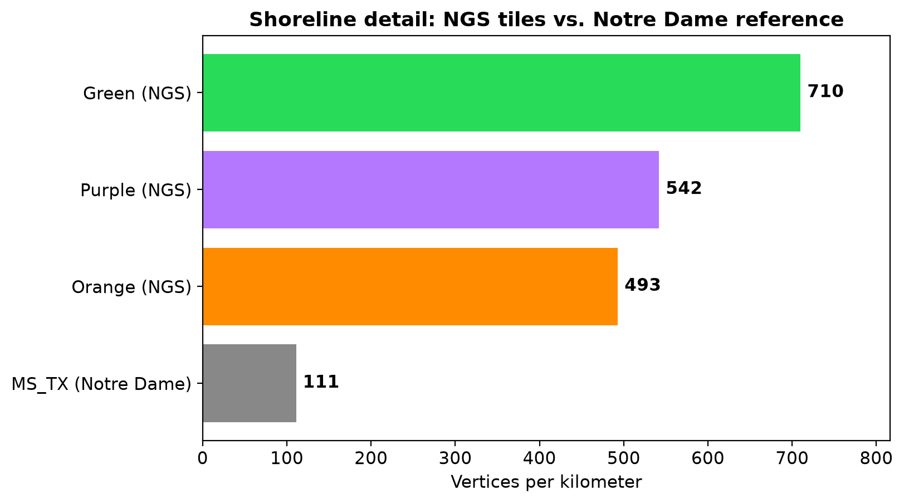
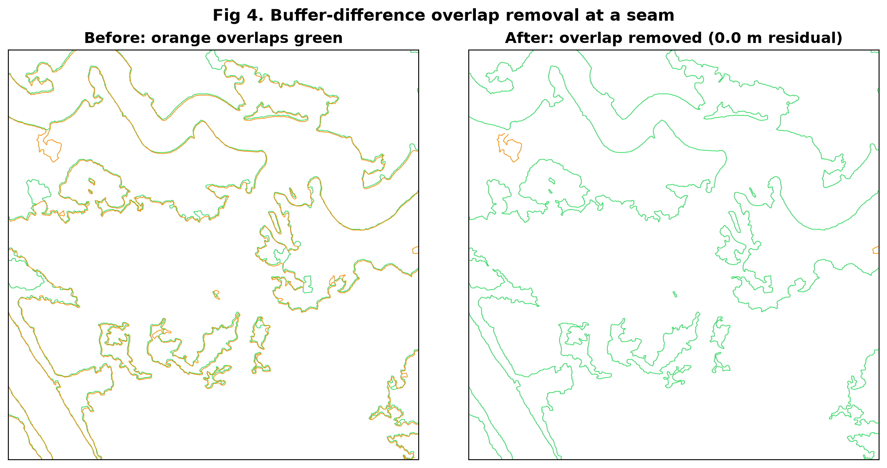
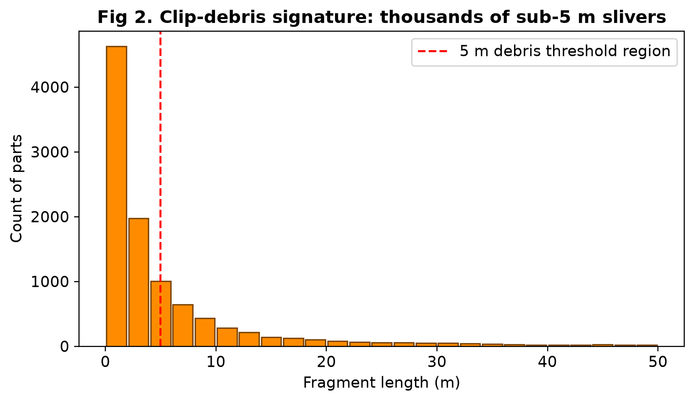
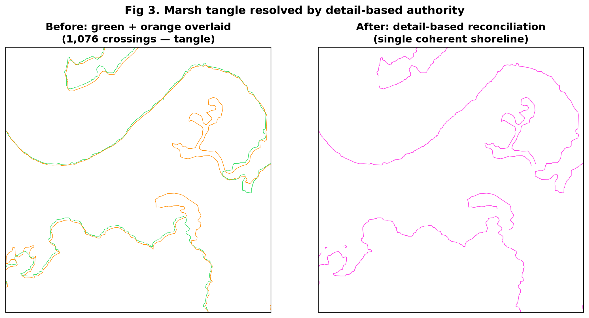
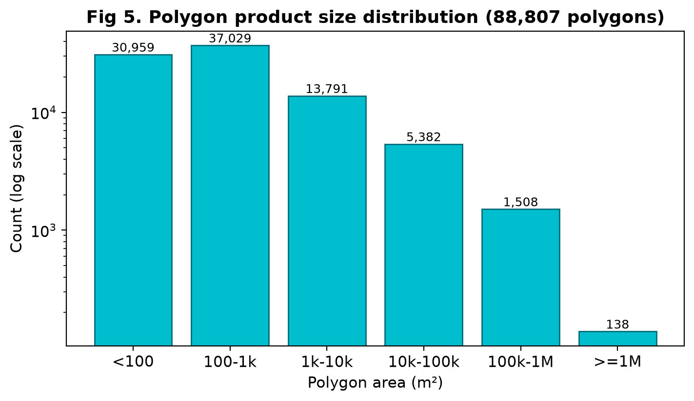

# Gulf of Mexico Shoreline Reconciliation - Methods & Results (RC1)

**Author:** Nate Murry - NOAA / NOS / CO-OPS
**Prepared for:** VDatum Modeling Team, for use in SMS Modeling Software
**Status:** Release Candidate 1 (RC1) - Modeler Review
**Date:** 2026-08-18
**Processing platform:** Ubuntu 24.04.4 LTS, PostgreSQL 17 / PostGIS 3.6, GDAL/OGR

---

## Executive Summary

We were provided several overlapping, high-resolution shoreline datasets covering
adjacent regions of the Gulf of Mexico. In the overlap strips, the *same* physical
features (islands, spits, marsh) were digitized independently by each dataset and do
**not** coincide - e.g., the two halves of an island are offset and overlap in the
middle without meeting. Overlapping, non-coincident linework of this kind breaks
mesh generation in SMS.

This effort produced two reconciled, non-overlapping deliverables covering the full
domain:

- **A merged shoreline LINE layer** - one coherent shoreline, redundant overlap
  removed, maximum source detail preserved.
- **A companion POLYGON layer** - closed land/island/water-body polygons derived
  from the line network, for defining land-vs-water regions in the mesh.

Both are delivered in WGS84 (EPSG:4326). All processing was **rule-based and
quantified** - we removed redundant/duplicate linework and derived polygons, but we
did **not** smooth, thin, or fabricate shoreline. Full source vertex detail is retained.

**Validation performed** (Section 6) indicates the products are structurally clean and
should ingest into SMS without the overlap/topology failures that motivated this work:
zero measured overlap between reconciled layers, 100% valid polygon geometries, and a
quantified accounting of open (non-polygonizing) shoreline that is preserved in the
line layer by design rather than falsely closed.

---

## The Problem

**Inputs (5 shoreline datasets):**

| Working color | Dataset (region) | Features | Native CRS |
|:--|:--|--:|:--|
| Purple | la2206 UTM15 (NGS) | 163,010 | NAD83(2011) |
| Green  | la2206 UTM16 (NGS) | 41,889  | NAD83(2011) |
| Orange | la2205 (NGS)       | 20,720  | NAD83 |
| Red    | la2207 (NGS)       | 787     | NAD83(2011) |
| (ref)  | MS_TX (Notre Dame) | 37,557  | NAD83 |

Full source filenames are `la2206_cm_c_utm15_merge_shrln_class`,
`la2206_cm_c_utm16_merge_shrln_class`, `la2205_cm_c_merge_shrln_class`,
`la2207_cm_c_merge_shrln_class`, and `MS_TX_New_Shoreline`.

The four NGS tiles are the subject of this reconciliation. The Notre Dame MS_TX layer
is a separate, coarser dataset used only for reference (Section 3) and is **not**
modified or merged here.

**Core issue:** where adjacent NGS tiles overlap, they redundantly trace the same
coastline with vertex-level disagreement. Merging them naively yields:
- **Overlapping / crossing linework** (two tracings of one feature), and
- In complex marsh, a **"tangle"** of thousands of criss-crossing segments and
  spurious micro-polygons.

Either condition is fatal to SMS mesh generation (unresolvable boundaries;
sub-meter elements forcing crippling CFL timesteps).

---

## Source Detail Assessment (why the NGS tiles, and why detail matters)

We quantified shoreline detail objectively as **vertices per kilometer** and average
inter-vertex segment length (computed directly from geometry, no subjective judgment):

| Dataset | Vertices / km | Avg segment length |
|---|---|---|
| Green (NGS)  | **710** | 1.4 m |
| Purple (NGS) | 542 | 1.9 m |
| Orange (NGS) | 493 | 2.0 m |
| **MS_TX (Notre Dame)** | **111** | 9.0 m |

The NGS tiles carry **4.5-6.4× the vertex density** of the Notre Dame layer - they
trace the coastline in far finer detail. Preserving that detail is the primary goal;
it is what makes this reconciliation worth doing rather than simply using the coarser
existing product.



---

## Method Evolution (what we tried, and why we changed)

The final method was reached by ruling out simpler approaches on evidence. Documenting
this path is deliberate - it justifies the final design.

### Attempt 1 - Concave-hull clipping (abandoned)

Initial approach (previously prototyped in ArcGIS/QGIS): convert one shoreline to
points, build a `ST_ConcaveHull` "shrink-wrap" polygon, and use it to clip the
overlapping neighbor. We reproduced this in PostGIS (grid-tiled for scalability) and
tuned the concavity coefficient from 0.1 (loose) down to 0.001 (tight).

**Why it failed - an inherent ceiling, not a tuning problem:** a hull is a polygon
*approximation* of where a shoreline is. No single concavity both hugs the shoreline
tightly *and* sweeps up all overlapping neighbor linework. Loose hulls over-cut (delete
good, unique data); tight hulls under-cut (leave residual overlap). At **every**
concavity tested, measurable overlap remained. Because even one residual overlap breaks
the model, the concave-hull method cannot meet the requirement regardless of tuning.

### Attempt 2 - Buffer-difference overlap removal (adopted)

Replace the hull with a direct, physical rule:

> Remove the portion of one shoreline that runs within *N* meters of another -
> i.e., where they trace the same feature - using
> `ST_Difference(lineA, ST_Buffer(lineB, N))`.

The parameter *N* is physically meaningful ("how close counts as duplicate"). Measured
result: **0.0 m residual overlap** at both N = 2 m and N = 5 m - versus the hull, which
always left overlap. Adopted at **N = 5 m**.



### Fragment cleanup (buffer-difference debris)

Differencing shatters co-tracing zones into many short slivers. A length histogram
showed thousands of sub-5 m fragments comprising ~2% of length, while genuine shoreline
lived in long segments. Critically, **every leftover stub sat at exactly the buffer
distance from the reference** - so *distance to the reference* is the discriminator.

We remove a fragment only if it is **both short (< 15 m) AND near the reference
(< 6 m)**. This surgically removes clip debris while preserving genuine short features
(a real short segment far from the reference, or a long segment near it, is kept).
Result: ~1,000 debris fragments removed for < 1% length loss; all real segments retained.



### Detail-based authority (the key refinement)

A simple "green always wins" precedence, applied during buffer-difference, revealed a
problem in complex marsh: it could delete the *more detailed* tracing in favor of the
*coarser* one, and where both datasets densely traced the same marsh (differing
vertex-by-vertex), the merge produced a tangle of crossings.

We measured detail cell-by-cell (500 m grid) across the overlap zone. Neither dataset is
uniformly finer: **green is denser in 289 cells, orange in 252.** The correct rule is
therefore not a fixed precedence but **per-zone detail preference**:

> In each cell, keep whichever dataset is more detailed; remove the other dataset's
> *duplicate* linework (within 5 m), while preserving its *unique* (non-duplicated)
> detail.

This eliminates the tangle (a representative marsh location dropped from 1,076
green/orange crossings to zero) while preserving the finest available detail
everywhere. Green and orange outside the overlap zone, and purple and red (which have
negligible / no overlap), are carried through unchanged.




### Polygon derivation and feature-size filtering

The reconciled line network is noded and polygonized (`ST_Node` then `ST_Polygonize`)
to derive closed land/island/water polygons. Two cleanup passes follow:

- **Artifact slivers:** near-zero-area, needle-thin loops from noding are removed
  (identified by both tiny area *and* extreme thinness = perimeter / √area).
- **Minimum feature size (per modeler guidance):** the modeling lead advised that
  features smaller than ~10 m in every direction may be dropped. We applied a
  **conservative 8 m** threshold (retaining slightly more detail than the 10 m
  allowance). Implemented via each polygon's **oriented bounding box**: a polygon is
  dropped only if **both** of its oriented sides are < 8 m - so thin real features
  (e.g., a 2 m × 500 m spit) are **preserved** while true small blobs are removed.

---

## Processing Pipeline (summary)

All geometry work was performed in PostGIS on a metric CRS (EPSG:6344, UTM 15N) so
every distance parameter (5 m buffer, 8 m feature size, etc.) is literal meters;
final products are reprojected to WGS84 for delivery.

```
Source shapefiles (5)
   |  load to PostGIS; keep original geometry + a metric (EPSG:6344) working copy
   v
[Detail assessment]  vertices/km per dataset (green 710 ... MS_TX 111)
   |
   v
[Authority map]      500 m cells; per cell winner = denser of green/orange
   |
   v
[Overlap removal]    per cell: keep winner whole; clip loser within 5 m of winner
   |                 (ST_Difference against 5 m buffer) -> removes duplicate co-tracing
   v
[Fragment cleanup]   drop parts that are BOTH < 15 m AND within 6 m of reference
   |
   v
[Assemble network]   detail-reconciled green/orange + untouched purple + red
   |
   v
[Polygonize]         ST_Node -> ST_Polygonize (tiled for scale)
   |
   v
[Poly cleanup]       remove noding-artifact slivers; drop features < 8 m in every
   |                 direction (oriented-bbox; thin spits preserved)
   v
RC1 deliverables (reproject -> WGS84 / EPSG:4326):
   - gom_shoreline_lines_RC1.gpkg   (230,022 lines)
   - gom_shoreline_polys_RC1.gpkg   (88,807 polygons)
```

Key parameters (all tunable, all physically meaningful):

| Parameter | Value | Meaning |
|---|---|---|
| Working CRS | EPSG:6344 (m) | metric so distances are literal |
| Overlap buffer *N* | 5 m | "within N m = duplicate co-tracing" |
| Fragment rule | < 15 m AND < 6 m of ref | remove clip debris only |
| Authority cell size | 500 m | resolution of detail-preference decision |
| Min feature size | 8 m (both oriented sides) | conservative vs. modeler's 10 m |

---

## Validation & Results

**Deliverables:**

| Layer | Features | CRS | Geometry |
|---|---|---|---|
| Merged shoreline (lines) | 230,022 | WGS84 (4326) | LineString |
| Companion polygons | 88,807 | WGS84 (4326) | Polygon (897 km² total) |



**Tests performed:**

1. **Overlap eliminated.** Buffer-difference reduced residual overlap between reconciled
   layers to **0.0 m** (measured), versus the concave-hull method which always left
   overlap. This directly addresses the failure that motivated the work.

2. **Tangle resolved.** At a representative complex-marsh location, green/orange
   crossings dropped from **1,076 to 0** after detail-based reconciliation - a coherent
   single shoreline replaces the interleaved mat.

3. **Polygon geometry 100% valid.** All 88,807 polygons pass `ST_IsValid`; **0 invalid,
   0 empty, 0 non-polygon**. No self-intersections or degenerate rings that would
   trip a mesher.

4. **Detail preserved.** Full source vertex density retained (no smoothing/thinning);
   per-zone detail preference keeps the finest available tracing everywhere
   (green in 289 cells, orange in 252).

5. **Open-shoreline accounting (honest dangle metric).** ~24% of line length does **not**
   close into a polygon. This is expected and correct: it comprises genuinely open
   coastline, the thin western strip (red), unique non-duplicated segments, and real
   gaps present in the *source* data. These are **preserved in the line layer** rather
   than closed with fabricated shoreline. The remaining ~76% forms closed polygons.

**Assessment:** Based on the above, the RC1 products are structurally clean and should
ingest into SMS without the overlap/topology problems that broke prior attempts. The
polygon layer is watertight where real features close; the line layer preserves
everything (including legitimately open features) for use as boundary constraints.

---

## Optional Polish & Contingencies (if SMS objects)

RC1 was deliberately released without the following optional steps, to obtain real SMS
feedback before further processing. **If SMS reports problems, these are ready options:**

- **Cell-boundary snapping.** Reconciliation decisions are made per 500 m cell. Visual
  review found the cell-to-cell transitions clean, but a *targeted* endpoint-snap along
  cell boundaries can be applied if SMS finds small gaps/jogs there. (A full
  whole-network self-snap was tested and found computationally impractical and
  unnecessary; a scoped boundary-only snap is the efficient alternative.)

- **Global line noding.** For a strictly, topologically fully-connected line network
  (every touch a shared node), a global node pass can be applied. Deferred because it is
  expensive and may be unnecessary for SMS's ingestion.

- **Feature-size threshold.** The 8 m minimum is conservative (modeler allowance was
  10 m). It can be raised toward 10 m to remove more small features, or lowered to keep
  more, per modeler preference - a one-parameter change.

- **Additional gap closing.** Some dangles are real source-data gaps (e.g., an island
  outline broken in the source with gaps up to hundreds of meters). We did **not**
  fabricate shoreline to close these. If specific features must be closed, they can be
  addressed in a reviewed, targeted pass.

All of the above are parameter/scope adjustments on the existing pipeline, not redesigns.

---

## What We Did NOT Do (data integrity statement)

To be explicit for downstream users:

- **No shoreline was smoothed, generalized, or thinned.** Full source vertex detail is
  retained (this is why the files are large).
- **No shoreline was fabricated.** Gaps present in the source remain open; we did not
  invent linework to force polygon closure.
- **Source datasets were never modified.** All processing produced new derived layers
  from read-only originals; every step is reproducible from source.
- **All removals were rule-based and quantified** (duplicate co-tracing within 5 m;
  clip debris < 15 m AND < 6 m of reference; artifact slivers; features < 8 m in every
  direction). No manual/hand editing of geometry.

The work is best characterized as **rigorous, rule-based geoprocessing of complex
overlapping datasets** - reconciliation and derivation, not manipulation.

---

## Files

| File | Contents |
|---|---|
| `RC1/gom_shoreline_lines_RC1.gpkg` | Merged shoreline line layer (WGS84) |
| `RC1/gom_shoreline_polys_RC1.gpkg` | Companion polygon layer (WGS84) |
| `gom_shoreline_pipeline.sql` | Reproducible PostGIS pipeline (functions + driver) |
| This document | Methods & results |

---

## Acknowledgments

**AI Assistance Disclosure:** Portions of this report were prepared with the
assistance of an AI language model (Claude Opus 4.8, via OpenCode). The analysis,
direction, interpretation, and conclusions are the author's own; AI was used as a
drafting and computational aid under the author's direction. The author has reviewed
all content and takes full responsibility for its accuracy and conclusions.

---

*RC1 - provided for modeler evaluation. Parameters and optional polish steps can be
tuned per SMS results before a final release.*
